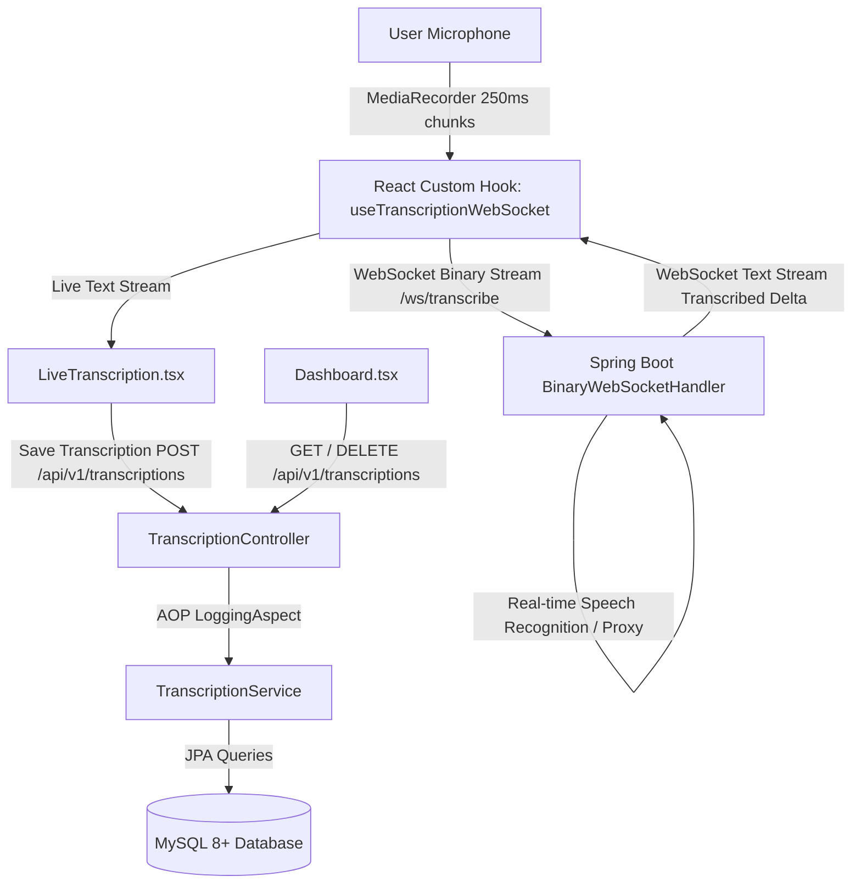

# 🎙️ VoiceFlow - Real-Time Multilingual Speech-to-Text Platform

> An enterprise-grade, real-time multilingual Speech-to-Text web application featuring continuous 250ms audio chunk WebSocket streaming, Spring Boot (Java 21) backend with AOP logging, MySQL persistence, and a modern React 18 + TypeScript + Bootstrap 5 frontend.

---

## 📌 Architecture Overview



- **Frontend**: React 18, TypeScript, Vite, Bootstrap 5, Axios, Lucide Icons, React Router DOM.
- **Backend**: Java 21, Spring Boot 3.x/4.x, Spring Data JPA, Spring WebSocket (`BinaryWebSocketHandler`), Aspect-Oriented Programming (AOP) with AspectJ.
- **Database**: MySQL 8.0+ (Automatic schema creation via Hibernate DDL).

---

## 📋 System Prerequisites

Before running the application, make sure you have the following installed on your system:

1. **Java JDK 21**: Verify with `java -version`
2. **Node.js 18+ & npm**: Verify with `node -v` and `npm -v`
3. **MySQL Server 8+** (or **Docker** to run MySQL with one command)

---

## 🚀 Quick Setup & Run Instructions

### 1. Database Setup

#### Option A: Using Local MySQL Server
Ensure MySQL is running on port `3306`. Check or adjust credentials in [`speech-to-text-backend/src/main/resources/application.properties`](speech-to-text-backend/src/main/resources/application.properties):
```properties
spring.datasource.url=jdbc:mysql://localhost:3306/transcription_db?createDatabaseIfNotExist=true&useSSL=false&allowPublicKeyRetrieval=true&serverTimezone=UTC&characterEncoding=UTF-8
spring.datasource.username=root
spring.datasource.password=root
```
*(Hibernate will automatically create the `transcription_db` database and `transcriptions` table).*

#### Option B: Using Docker (One-Command Database)
If you don't have MySQL installed locally, simply run:
```bash
docker compose up -d
```
*(This starts a pre-configured MySQL 8.0 container on port 3306).*

---

### 2. Run the Spring Boot Backend

Open a terminal and navigate to the backend directory:

```bash
cd speech-to-text-backend
```

**On Windows:**
```cmd
.\mvnw.cmd spring-boot:run
```

**On macOS / Linux:**
```bash
./mvnw spring-boot:run
```

- **Backend API URL**: `http://localhost:8080/api/v1/transcriptions`
- **WebSocket Streaming URL**: `ws://localhost:8080/ws/transcribe`

---

### 3. Run the React Frontend

Open a new terminal window and navigate to the frontend directory:

```bash
cd speech-to-text-frontend
npm install
npm run dev
```

Open **`http://localhost:5173`** in your browser.

---

## 🎯 Key Application Features

1. **Live Speech-to-Text Studio (`/`)**:
   - Continuous microphone capture using `MediaRecorder` in 250ms binary timeslices.
   - Live speech recognition in multiple languages (English, Spanish, French, German, Hindi, Japanese, etc.).
   - Visual audio wave animations, real-time telemetry (chunks sent, latency), and word/character counters.
   - One-click **"Save to DB"** to persist final transcripts to MySQL.

2. **Records Dashboard (`/dashboard`)**:
   - Historical transcriptions table with ID, Transcribed Text, Language Badge, and Date.
   - Real-time search by keyword and filter by target language.
   - Modal full-text preview and instant deletion.

3. **Enterprise AOP Logging**:
   - Spring Boot `@Aspect` and `@Around` logs every method entry, arguments, elapsed execution time in ms, and exit values across all controllers and service implementations.

---

## 📡 REST API Documentation

| Method | Endpoint | Description | Sample Payload / Params |
| :--- | :--- | :--- | :--- |
| `POST` | `/api/v1/transcriptions` | Persist a new transcription | `{"originalText": "...", "languageCode": "en-US"}` |
| `GET` | `/api/v1/transcriptions` | Fetch all historical records | `?language=es-ES` (optional) |
| `GET` | `/api/v1/transcriptions/{id}` | Fetch a specific record by ID | Path variable: `id` |
| `DELETE` | `/api/v1/transcriptions/{id}` | Delete a record by ID | Path variable: `id` |

---

## 📁 Directory Structure

```
.
├── docker-compose.yml              # Docker MySQL setup
├── README.md                       # Complete documentation
├── speech-to-text-backend/         # Java 21 & Spring Boot Backend
│   ├── pom.xml
│   ├── mvnw.cmd / mvnw             # Maven Wrapper scripts
│   ├── Dockerfile                  # Cloud deployment container definition
│   └── src/
│       ├── main/resources/
│       │   ├── application.properties
│       │   └── schema.sql          # Standalone SQL schema
│       └── main/java/com/procucev/transcriptionbackend/
│           ├── entity/             # JPA Entities
│           ├── dto/                # REST Payloads & Error Responses
│           ├── repository/         # Spring Data JPA Repositories
│           ├── exception/          # @ControllerAdvice Global Error Handlers
│           ├── aspect/             # AOP Logging Aspect
│           ├── service/            # Business Logic Layer
│           ├── controller/         # REST Controllers
│           └── config/             # Spring WebSocket Handlers
└── speech-to-text-frontend/        # React 18, TypeScript, Vite & Bootstrap 5
    ├── package.json
    ├── vite.config.ts
    ├── src/
    │   ├── types/                  # TypeScript interfaces
    │   ├── services/               # Axios REST client
    │   ├── hooks/                  # Custom WebSocket & Audio stream hook
    │   ├── pages/                  # LiveTranscription & Dashboard views
    │   ├── App.tsx                 # Navigation & Routing
    │   └── main.tsx
```
